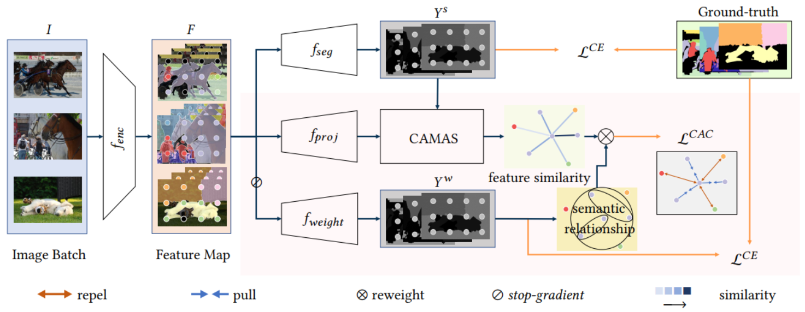

# Confidence-Aware Contrastive Learning for Semantic Segmentation


## Introduction
The repository contains official Pytorch implementations of training and evaluation codes for **CAC loss**.

The code is based on [MMsegmentation v0.28.0](https://github.com/open-mmlab/mmsegmentation/tree/v0.28.0).
## Installation
1. Follow [tutorial](https://pytorch.org/get-started/) to install pytorch1.10.1(or 1.10.2)
2. Please refer to guidelines in [MMsegmentation v0.28.0](https://github.com/open-mmlab/mmsegmentation/tree/v0.28.0) to install [mmsegmentation](https://github.com/open-mmlab/mmsegmentation/blob/v0.28.0/docs/en/get_started.md) with all prerequisites and prepare [dataset](https://github.com/open-mmlab/mmsegmentation/blob/v0.28.0/docs/en/dataset_prepare.md#prepare-datasets).
3. Follow guidelines in [pytorch-geometric](https://pytorch-geometric.readthedocs.io/en/latest/notes/installation.html) to install torch-scatter and torch-sparse 
4. Install other requirements.
```python
pip install einops

pip install future tensorboard

python -m pip install cityscapesscripts

pip install setuptools==58.0.4
```
5. Modify the data_root to yours for all datasets you need under configs/\_base\_/datasets/ 

## Training
Take a 4-card experiment as an example:
```python
CUDA_VISIBLE_DEVICES=0,1,2,3 PORT=29513 bash tools/dist_train.sh configs/cac_hrnet/fcn_hr48_4x2_512x1024_40k_cityscapes_lr0.01_0.4_0.1_1.5.py 4
```

## Testing
For single-scale test:
```python
CUDA_VISIBLE_DEVICES=0,1,2,3 PORT=29513 bash tools/dist_test.sh configs/cac_hrnet/fcn_hr48_4x2_512x1024_40k_cityscapes_lr0.01_0.4_0.1_1.5.py \
    work_dirs/fcn_hr48_4x2_512x1024_40k_cityscapes_lr0.01_0.4_0.1_1.5/latest.pth 4 --eval mIoU
```
For multi-scale test:
```python
CUDA_VISIBLE_DEVICES=0,1,2,3 PORT=29513 bash tools/dist_test.sh configs/cac_hrnet/fcn_hr48_4x2_512x1024_40k_cityscapes_lr0.01_0.4_0.1_1.5.py \
    work_dirs/fcn_hr48_4x2_512x1024_40k_cityscapes_lr0.01_0.4_0.1_1.5/latest.pth 4 --eval mIoU --aug-test
```
We adopt different image ratios in multi-scale test for different dataset, remember to modfiy tools/test.py as follows(Cityscapes as an example):
```python
if args.aug_test:
    # hard code index
    cfg.data.test.pipeline[1].img_ratios = [
        0.5, 0.75, 1.0, 1.25, 1.5, 1.75
    ]
    cfg.data.test.pipeline[1].flip = True
```
Specially, to perform test on Cityscapes test, add the follow code into config:
```python
data = dict(
    test=dict(
        img_dir='leftImg8bit/test',
        ann_dir='gtFine/test'))
```
and use the follow command to generate results, then submit them to [Cityscapes](https://www.cityscapes-dataset.com/).
```python
CUDA_VISIBLE_DEVICES=0,1,2,3 PORT=29513 bash tools/dist_test.sh configs/cac_hrnet/fcn_hr48_4x2_512x1024_40k_cityscapes_lr0.01_0.4_0.1_1.5.py \
    work_dirs/fcn_hr48_4x2_512x1024_40k_cityscapes_lr0.01_0.4_0.1_1.5/latest.pth 4 --format-only \ 
    --eval-options "imgfile_prefix=./fcn_hr48_4x2_512x1024_40k_cityscapes_lr0.01_0.4_0.1_1.5/" --aug-test
```


## Results

###  Cityscapes 

For multi-scale(ms) test, we adopt flip and image ratios of [0.5, 0.75, 1.0, 1.25, 1.5, 1.75]. Results may fluctuate due to random seed, and the first two lines of results are reported for code that implemented based on [mmseg-0.22.0](https://github.com/open-mmlab/mmsegmentation/tree/v0.22.0).

|     Method      |  Backbone  | Train Set | Eval Set |  LR  | Batch | Iters | mIoU |                            Config                            |
| :-------------: | :--------: | :-------: | :------: | :---: | :---: | :---: | :---: | ------------------------------------------------------------ |
| HRNet(baseline) | HRNetV2-48 |   train   |   val    | 0.01 | 4x2  |  40K  | 79.5 | [config](./configs/hrnet/fcn_hr48_512x1024_4x2_40k_cityscapes_lr0.01_baseline.py) |
|    HRNet+CAC    | HRNetV2-48 |   train   |   val    | 0.01 | 4x2  |  40K  | 81.6 | [config](./configs/cac_hrnet/fcn_hr48_4x2_512x1024_40k_cityscapes_lr0.01_0.4_0.1_1.5.py) |
| HRNet(baseline) | HRNetV2-48 |   train   |   val    | 0.01 | 4x2 | 120K | 80.8 | [config](configs/hrnet/fcn_hr48_512x1024_4x2_120k_cityscapes_lr0.01_baseline.py) |
|    HRNet+CAC    | HRNetV2-48 |   train   |   val    | 0.01 | 4x2 | 120K | 82.2 | [config](configs/cac_hrnet/fcn_hr48_4x2_512x1024_120k_cityscapes_lr0.01_0.4_0.1_1.5.py) |
| HRNet(baseline) | HRNetV2-48 |   train   |   test   | 0.01  |  4x2  | 120K  | 80.2(ms) | [config](configs/hrnet/fcn_hr48_512x1024_4x2_120k_cityscapes_lr0.01_baseline.py) |
|    HRNet+CAC    | HRNetV2-48 |   train   |   test   | 0.01  |  4x2  | 120K  | 81.4(ms) | [config](configs/cac_hrnet/fcn_hr48_4x2_512x1024_120k_cityscapes_lr0.01_0.4_0.1_1.5.py) |
| OCRNet(baseline)| HRNetV2-48 |   train   |   val    | 0.01  |  4x2  | 120K  |   81.4   | [config](configs/ocrnet/ocrnet_hr48_4x4_512x1024_120k_cityscapes_lr0.01_baseline.py) |
|    OCRNet+CAC   | HRNetV2-48 |   train   |   val    | 0.01  |  4x2  | 120K  |   82.3   | [config](configs/cac_ocrnet/ocrnet_hr48_4x2_512x1024_120k_cityscapes_lr0.01_0.6_0.1_1.5.py) |
| OCRNet(baseline)| HRNetV2-48 |   train   |   test   | 0.01  |  4x2  | 120K  | 81.4(ms) | [config](configs/ocrnet/ocrnet_hr48_4x4_512x1024_120k_cityscapes_lr0.01_baseline.py) |
|    OCRNet+CAC   | HRNetV2-48 |   train   |   test   | 0.01  |  4x2  | 120K  | 81.8(ms) | [config](configs/cac_ocrnet/ocrnet_hr48_4x2_512x1024_120k_cityscapes_lr0.01_0.6_0.1_1.5.py) |

### ADE20K
For multi-scale(ms) test, we adopt flip and image ratios of [0.5, 0.75, 1.0, 1.25, 1.5, 1.75].

### PASCAL_Context
For multi-scale(ms) test, we adopt flip and image ratios of [0.25, 0.5, 0.75, 1.0, 1.25, 1.5, 1.75].

### COCO-Stuff
For multi-scale(ms) test, we adopt flip and image ratios of [0.25, 0.5, 0.75, 1.0, 1.25, 1.5, 1.75].
